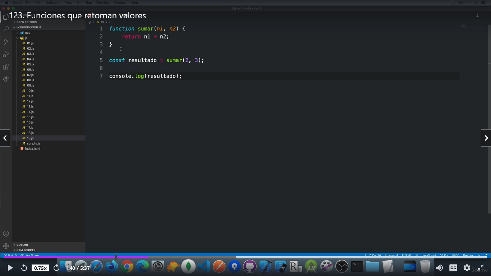

# Funciones que retornan valores
## Código:
---
---
function sumar(n1, n2) {
    return n1 + n2;
}

const resultado = sumar(2, 3);

console.log(resultado);
---
---
*En esta función convocamos la suma, se produce un retorno (return)asignamos una variable (resultado) y nos hace la suma 2 + 3 = 5 (En la consola da 5)*

### Foto del código

 
---

Links Automáticos
<https://www.udemy.com/course/desarrollo-web-completo-con-html5-css3-js-php-y-mysql/learn/lecture/24122496#overview>

---

#### Tips de Markdown

**Esta es una prueba de uso de letra negrita**

*Esta es una prueba de uso de letra cursiva*

# Anular Markdown:
De esta forma anulas *markdown\*
si le quitamos la barra invertida vuelve a cursiva.

---

 

